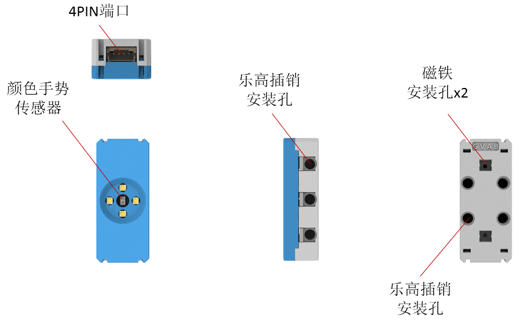
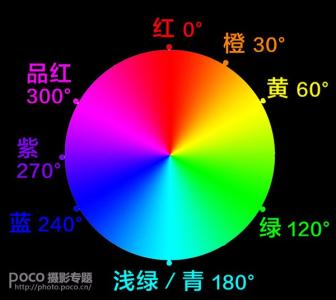
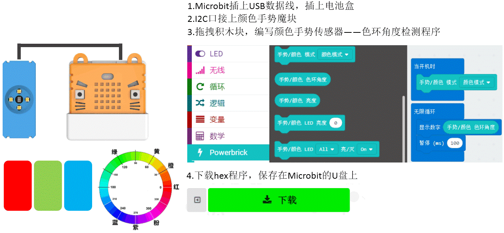
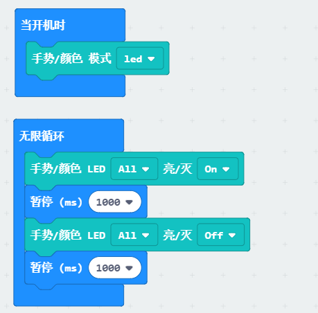

# 颜色手势魔块

Color/Gesture

此模块是一个多功能的模块，主要功能是识别颜色和识别手势。
颜色识别模式下，4颗LED常亮，颜色检测返回色环角度值。
手势识别模式下，手的运动方向，会触发对应方向的LED闪烁一下。
距离检测模式下，最远范围3cm左右，越靠近，4个LED亮度越亮。
无模式设置时，4颗LED亮度和亮灭状态可控。
颜色识别模式下，可以检测环境光强。

## 详细介绍

## 参数介绍

- 支持电压： 3V-5V
- 尺寸：56mm X 24mm X 16mm
- 接口：PH2.0 4PIN端子 ，引脚服从GVAB排布
- 手势识别模式下，可识别上右下左四个移动方向，分别返回值为1、2、3、4。没有检测到手势时，返回值为0。
- 近距模式下，最大检测距离为3cm左右，返回值为0-255，越靠近数值越大。
- 亮度检测返回值范围：0-255

对应Makecode编程界面：

Makecode在线地址：https://makecode.microbit.org/beta#editor

加载Powerbrick插件地址：https://github.com/KittenBot/pxt-powerbrick

## 使用注意事项

- 颜色手势魔块只能接在I2C接口上进行使用，其他Port口无效。
- 使用颜色手势魔块前，需要进行模式初始化设置。（如果不进行初始化设置，默认进入近距模式）
- 手势识别模式下，手的距离、运动方向、运动速度需要自己多次调整尝试，掌握合适的距离、方向、速度，才能触发正确的手势识别。
- 颜色返回值——色环角度，用于对颜色进行判断。
- 颜色识别下，魔块距离检测物体表面1cm左右，颜色识别效果最好。
- 在无模式设置下，才能对4颗LED进行亮灭控制和亮度控制。

## 颜色手势魔块——颜色检测演示

利用了颜色检验和全彩点阵显示颜色。做了一个魔法吸色装置。检测到什么颜色后，就会显示相应的颜色

PS：由于颜色传感器的检测误差和点阵LED颜色误差。点阵显示的颜色很难与检测物体颜色完全一致，只能是比较接近。

## 颜色手势魔块——手势检测演示

用手指在传感器上方对应划过，可以触发检测到不同的手势，一共有上下左右4种情况，手势检测与手靠近的距离，移动的速度有关系，需要多次尝试，掌握窍门。检测的成功率就会比较高。

## 颜色手势魔块——4颗LED控制演示

颜色手势模块上有4颗LED灯，在LED模式下，可以进行自由亮灭控制或者亮度控制

## 颜色手势魔块——环境光亮度检测演示

颜色手势模块可比较准确检测环境光强，这里演示，当环境光越强，microbit上显示的LED点数就会越多。

## 编程介绍

### 颜色识别编程

颜色识别常用此模块：

它可以将识别回来的颜色返回一个唯一的数值，色环角度与颜色的对应关系如下图：

举个栗子，当模块识别到黄色时，返回的数值大约是60

----------

简单测试：

----------

将识别回来的颜色，显示在点阵屏上：

----------

亮度检测：

----------

### 近距离模式编程

检测的距离范围约3CM，距离返回来的值是0~255，约靠近传感器，值越大，数值并没有实际的物理意义。只是做一个阈值判读。

### 手势识别编程

用一根手指在传感器上方大概1.5cm左右的距离，滑动。在没有识别到手势时，返回数值0，识别到上左下右时，分别返回数值1、2、3、4

### LED控制编程

在LED模式下，可以自由控制模块的4颗LED闪烁

