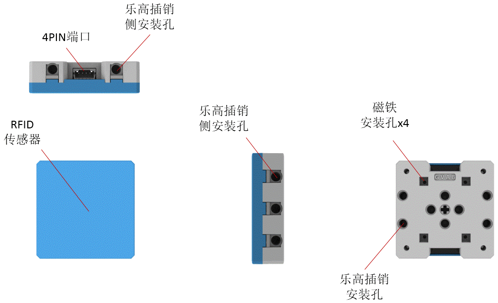

# RFID魔块

RFID

此模块可以对套件配套的RFID卡或者空白RFID卡进行读写，用于权限验证的DIY制作。常规的公交卡、地铁卡是无法进行写入，但可以读取UID号。配套RFID卡内存为1K，有16个分区，每个分区有3个数据块可进行写入此模块可以对套件配套的RFID卡或者空白RFID卡进行读写，用于权限验证的DIY制作。常规的公交卡、地铁卡是无法进行写入，但可以读取UID号。配套RFID卡内存为1K，有16个分区，每个分区有3个数据块可进行写入

## 详细介绍

## 参数介绍

- 支持电压： 3V-5V
- 尺寸：56mm X 24mm X 16mm
- 接口：PH2.0 4PIN端子 ，引脚服从GVAB排布
- 感应距离：≤3CM
- 感应到卡，指示灯Card会亮。模块有读写操作，指示灯Working会闪烁。

对应Makecode编程界面：

Makecode在线地址：https://makecode.microbit.org/beta#editor

加载Powerbrick插件地址：https://github.com/KittenBot/pxt-powerbrick

## 使用注意事项

- RFID需要避免在强磁下使用，避免干扰。
- RFID卡与模块之间不能有金属片阻挡，否则会无法进行数据读写。
- RFID卡在写入大量数据时速度较慢，请注意是否写入完成后，再把RFID卡取走。
- 常规的公交卡、地铁卡是无法进行写入（因为卡被加密了），但可以读取UID号（每一张卡都有唯一的ID号），可用于权限鉴别的制作。

## 编程介绍

### RFID写入编程

### RFID读出编程

