# 全彩点阵魔块

RGB

此模块是8x8的全彩点阵屏，可以单独控制任意一个点的颜色或者整个屏幕的颜色。支持点阵屏之间串接，无缝组成16x16或者8x32等点阵屏，让显示效果更加丰富。我们提供可视化的点阵屏图形编辑器，可以直接在编辑器上作画或者导入简单图片，最终在全彩点阵屏显示出来。

## 详细介绍

## 参数介绍

- 支持电压： 3V-5V
- 尺寸：56mm X 24mm X 16mm
- 接口：PH2.0 4PIN端子 ，引脚服从GVAB排布
- 像素：8x8全彩

对应Makecode编程界面：

Makecode在线地址：https://makecode.microbit.org/beta#editor

加载Powerbrick插件地址：https://github.com/KittenBot/pxt-powerbrick

## 使用注意事项

- 点阵屏上有两个接口，输入和输出，单个使用时，输入接口与Armourbit连接。
- 多个点阵屏之间拼接，前一个点阵屏的输出口，与下一个点阵屏的输入口连接，最终组成一个大点阵屏。
- 彩色点阵屏之间拼接，在电池盒供电状态下，最多拼接4个。如需接更多，需外接电源。可适当降低点阵亮度（通常用亮度10已足够），以此减少电流。
- 长时间使用彩色点阵屏请注意模块散热。

## 编程介绍

### 全彩点阵屏彩虹编程

实物接线：

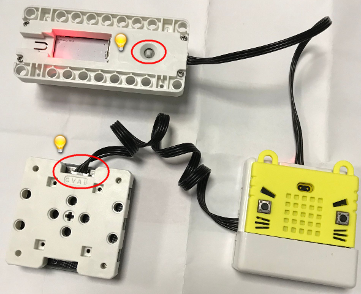

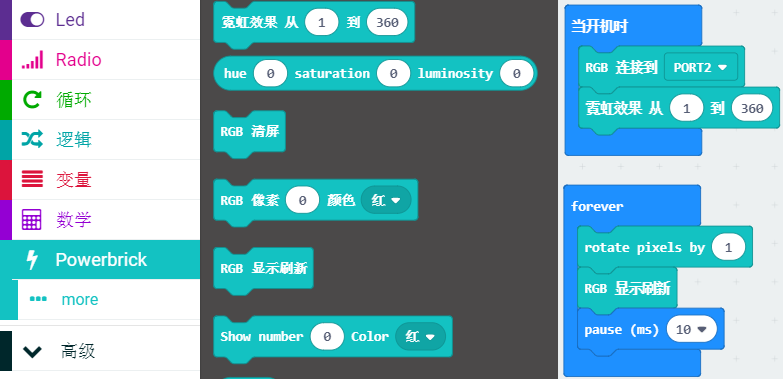

## 多屏拼接示例

## 多屏进阶使用

多屏组合暂时有两种，4个屏组合在一起，16x16刚好能显示一个中文字，或者是32x8能显示一串英文字符。当然了还有各种图案。

由于makecode在线版是服务器的原因，全彩点阵屏无法像microbit 5x5的点阵屏那样，可以在软件点选编辑。

但聪明的程序猿，在离线版本（离线版本没有底层限制），增加了专门一个页面可以进行软件编辑。

离线版本3.1以上都支持这个全彩点阵屏专门页面编辑。

[离线版本3.4下载地址（点我）](http://cdn.kittenbot.cn/makecode/win/Makecode%20Setup%203.4.0.exe)

下载安装

### 加载NeoMatrix插件

NeoMatrix是喵家专门针对全彩点阵屏开发的Microbit扩展插件

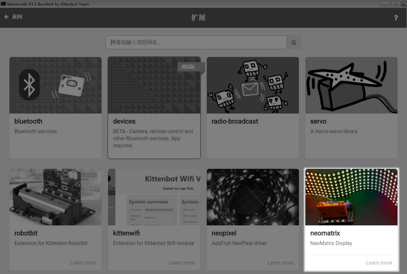

### Powerbrick插件也要加载

### 点击NeoMatrix Editor 跳转二级编辑页面

第一次跳转编辑页面，需要加载一段时间，稍微等候下

界面大概这样子~

### 显示中文

操作很简单：三步

1. 选择屏幕类型

2. 输入字符（不限于中文字）

3. 输出Powerbrick编程块

----------

具体操作：

这里我们选择16x16类型（对应4个全彩点阵需要拼成田字形状）

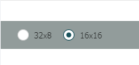

内容我们输入“小”字，并点击渲染文字

最后点击Powerbrick，再点击左上角的返回，回到编程界面

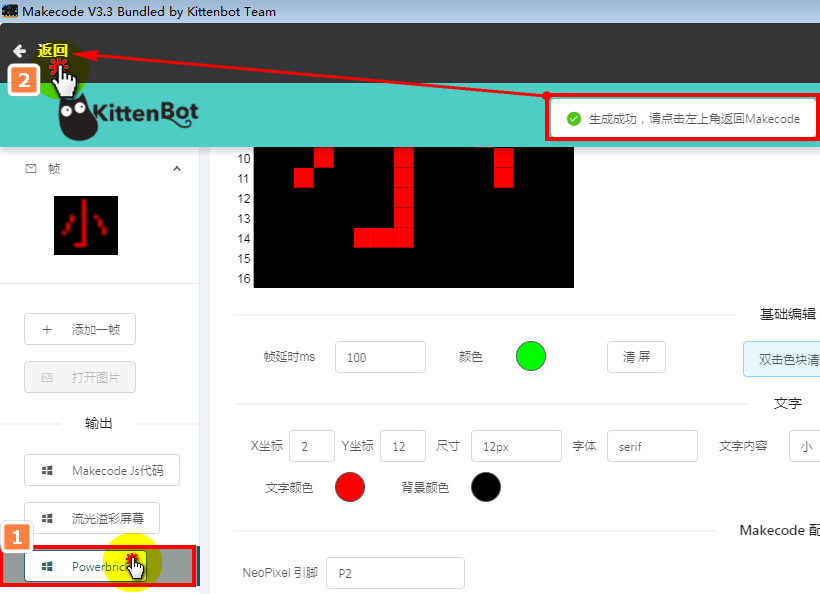

“小”字积木块就会显示在栏目中，拖拽一个开机显示“小”字的程序、

注意一定是拖拽Powerbrick的初始化积木块，并设置好实物对应的接口，与拼接方式。

重复上面的方法，我们把“小、喵、科、技”四个字完成

需要加入空白帧，如图所示

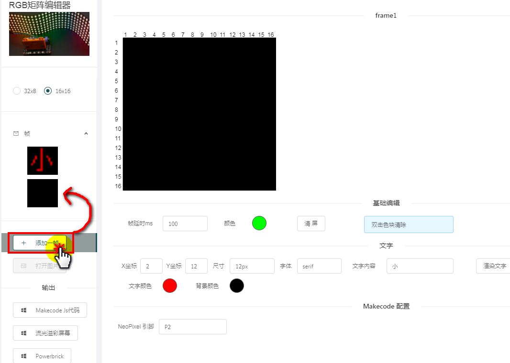

常用还有这几个设置

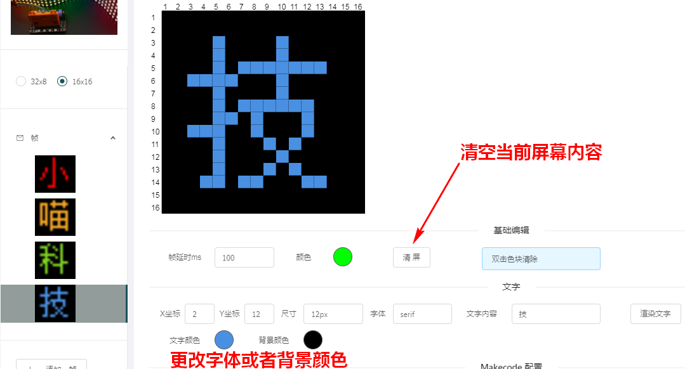

最后！一定要记得输出！一定要记得输出！一定要记得输出！

返回编辑界面，编写一个显示小喵科技的程序，最后下载

得到效果如下：

### 显示图片

直接把16x16像素大小的图片（简单卡通图比较合适）拖拽到界面中

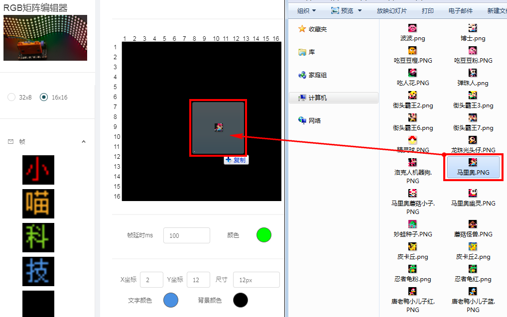

成功加载，考考大家这个是什么人物？

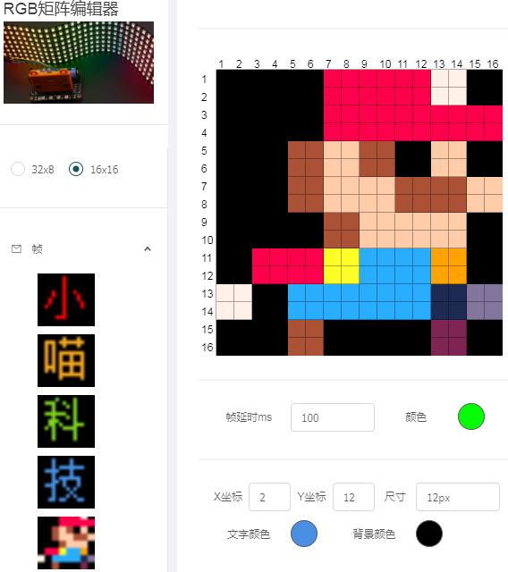

点输出后，回到编程页面中，修改程序，下载到Armourbit上

实验现象:

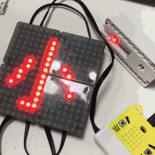

### 自由绘画

当然也支持自由绘图模式，可以自由绘制自己想要的图案，操作方法如下：

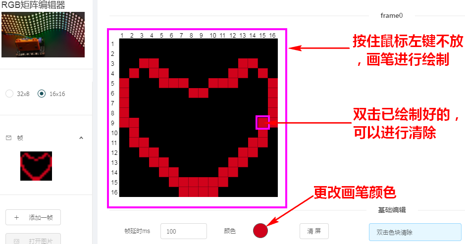

最后记得输出，并下载程序

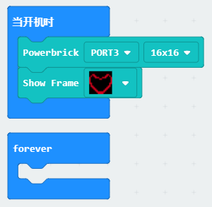

最终得到的实验结果：

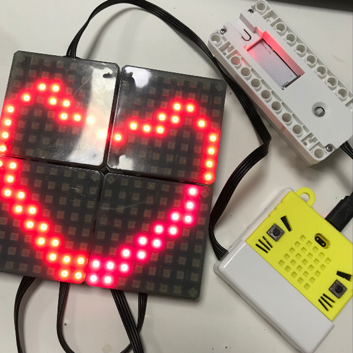

## 程序——彩虹灯

## 程序——全屏红绿蓝

## 程序——RGB三个数值控制颜色

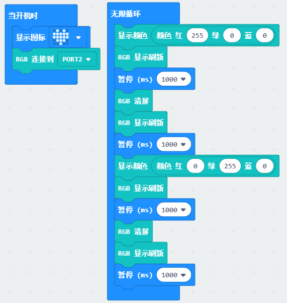

## 程序——逐颗灯点亮

## 程序——显示数字0-99

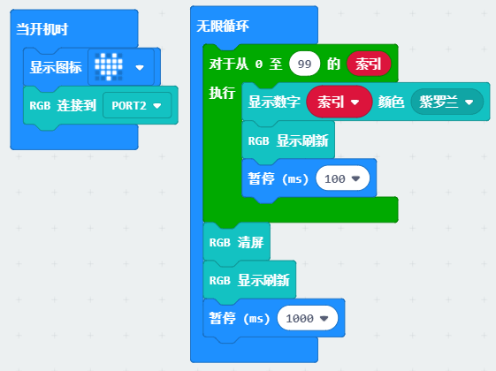

## 程序——坐标控制LED亮

## F&Q 常见问题与解答

**我都按照教程做了，程序也对，屏幕就是不能亮起来？**

因为点阵屏要求的电流比较大，必须接电池盒。如果你电池盒已经接了，检测自锁按键是否摁下？18650电池电量是否充足

**我打不开点阵屏编辑页面？**

点阵屏编辑界面是在喵家的服务服务器上，所以要求**电脑必须连接网络**。
