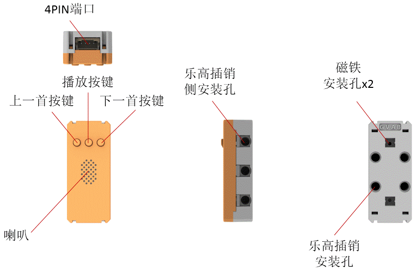
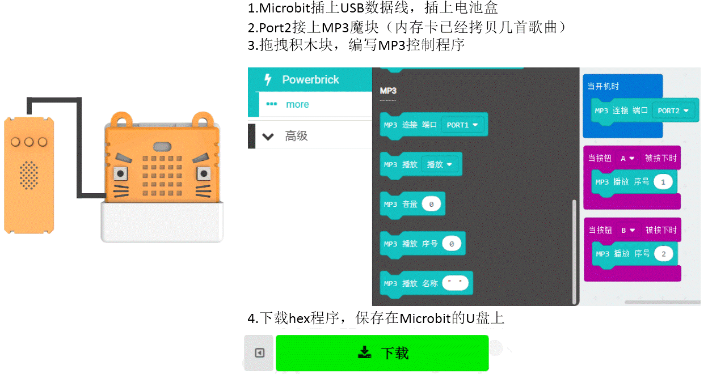
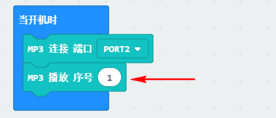
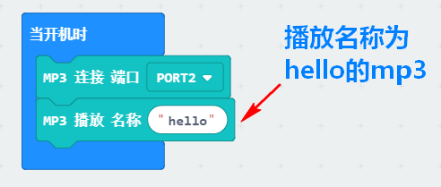

# MP3魔块

MP3

模块带有小喇叭与内存卡卡槽，可以播放内存卡的音频。上面还带三个按键，播放，前一首，后一首。以串口协议与Armourbit进行通讯，可以用程序控制播放内存卡的指定歌曲等。

## 详细介绍

## 参数介绍

- 支持电压： 3V-5V
- 尺寸：56mm X 24mm X 16mm
- 接口：PH2.0 4PIN端子 ，引脚服从GVAB排布
- 内存卡支持：TF卡，内存最大支持32G,FAT32格式
- 支持音频格式：MP3、WAV
- 模块自带三个按键：播放、上一首、下一首
- 拷贝歌曲：用内存卡读卡器进行拷贝，再把内存卡装到模块上

对应Makecode编程界面：

Makecode在线地址：https://makecode.microbit.org/beta#editor

加载Powerbrick插件地址：https://github.com/KittenBot/pxt-powerbrick

## 使用注意事项

- 购买的套件上是没有配送内存卡，内存卡需要另行购买
- MP3模块需要有内存卡，且内存卡中存有可播放的音频，点击模块的播放按键才能有歌曲播放出。
- 安装内存卡需要注意，此内存卡座是自弹式卡座。需要把内存卡往前推，听到“咔哒”一声，内存卡即安装好。（卡座比较深，你需要用扁长的工具去辅助安装，例如RFID卡）
- 取出内存卡需要注意，需要按一下内存卡，才会弹出来，不要硬拔，会导致卡座与内存卡损坏。

## MP3的内存卡安装

为了应对教学使用场景，防止小熊孩随意把内存卡拔出来弄丢。模块的内存卡卡座是弹卡式内存卡座

此MP3的内存卡卡座隐藏比较深，安装内存卡，或者退出内存卡需要借助扁型的工具（如RFID卡片）进行辅助安装，用卡片将TF卡推进去。

**内存卡卡座是贴近白色底壳那面**

操作如下：

## MP3的内存卡退出

同理，借助RFID卡将TF卡退出

## 按键控制MP3歌曲播放编程

## 程序——设置音量最大，并开机播放

模块出厂默认音量设置为一半大小，如果需要更大音量，需要初始化设置，音量设置是可以断电保存的

## 程序——播放特定序号的MP3（序号点播）

序号的排列是根据你内存卡的歌曲的排列顺序

## 程序——播放特定名称的MP3（名称点播）

名称只支持英文字符串或者，长度只能填入不能超过8个字母，所以歌曲命名尽量特别一点

