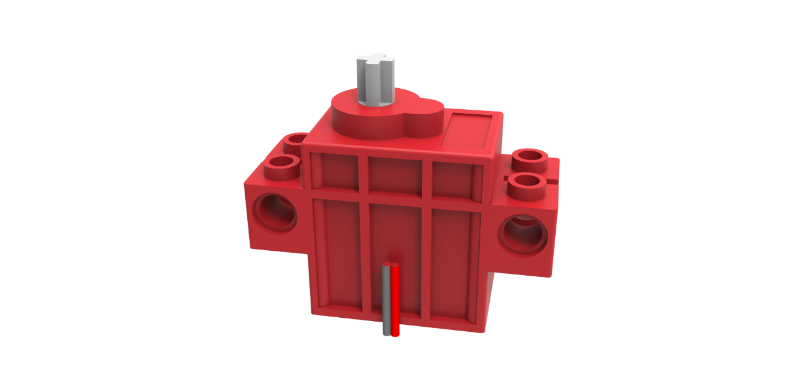

# Geekservo

## Geekservo电机

Geekservo motor

它是一款兼容乐高结构件的减速直流电机。输出轴为标准的乐高十字轴。主要用作360转动的结构结构或小车类制作。

## 规格

工作电压：3.3V~6V
额定电压：4.8V
额定电流：200ma
堵转电流：700ma
打滑电流：450ma
最大扭矩：500g.cm
最高转速：70rpm（3V供电情况下）
净重：12.4g（单个）
接口：红黑线（没有严格正负极，调换线序只会影响电机正反转）

## Geekservo舵机

它是一款兼容乐高结构件的舵机。输出轴为标准的乐高十字轴。主要用于动作关节类控制。

## 规格

- 工作电压：3.3V~6V
- 额定电压：4.8V
- 额定电流：200ma
- 堵转电流：700ma
- 打滑电流：450ma
- 最大扭矩：500g.cm
- 角度转速：60°/0.12s
- 净重：12.8g（单个）
- 
常规舵机线序：

棕色接负极

红色接正极

黄色接数据引脚（控制引脚）

## Geekservo特色

- 极力齿过载保护。
遇到输出轴被暴力拧时，极力齿就开始工作，会进行哒哒哒进行跳齿保护。而不会损坏舵机。

- 安装方式灵活。
有Technical安装方式与普通乐高砖块两种安装方式。输出轴是乐高标准的十字轴

- 体积小巧。
方便各种小制作的搭建。

- 控制简单。
乐高舵机采用了常规的脉宽方式控制，与常规9g小舵机控制方式类似。乐高电机可以用普通电机驱动板输出PWM脉冲进行速度控制。

## 注意事项

- Geekservo属于小型电机类，使用场景不要超出最大扭矩要求和不要超出最大电压要求。
- Geekservo舵机有严格的线序要求，请根据线序进行插接。Geekservo电机无线序要求，调换线序只会影响电机正反转。
- Geekservo禁止长时间堵转，长时间堵转有可能导致电机烧坏。

## 规格尺寸

- 长度：五个乐高孔电源8x5=40mm
- 宽度：两个乐高宽度单元8x2=16mm
- 高度：三个乐高高度单元3.2x3=9.6mm
- 基础孔位：直径4.8
- 输出轴：带极力齿乐高十字轴

## Geekservo电机编程

Armourbit上一共有两个直流电机接口，分别是M1和M2。使用时，注意程序与实物接线要对应。

（如果你使用Robotbit或者Rosbot主控板，只需要把Geekservo电机插接到电机接口，对应编程使用即可）

## Geekservo舵机编程

Armourbit上一共有八个舵机接口，分别是S1-S8。使用时，注意程序与实物接线要对应。

（如果你使用Robotbit或者Rosbot主控板，只需要把Geekservo舵机插接到舵机接口，对应编程使用即可）

