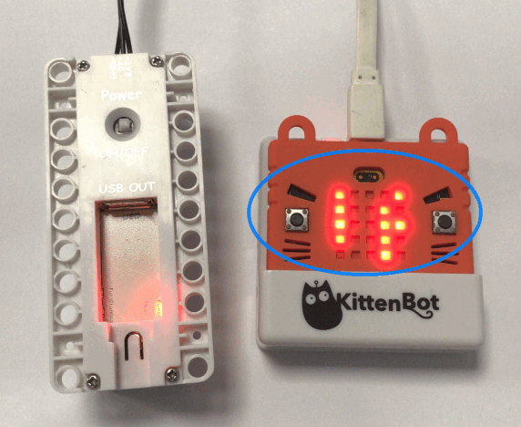
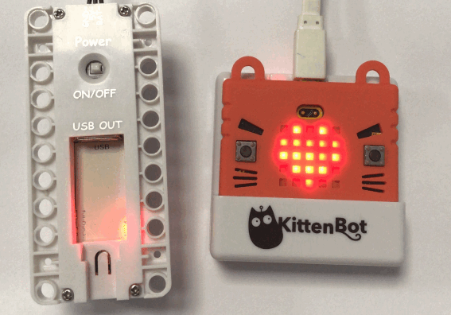
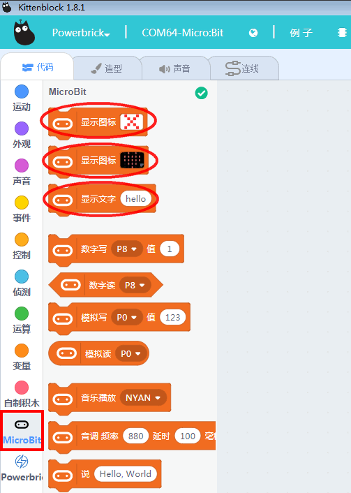

# Powerbrick硬件介绍与快速开始

## Powerbrick简介

Powerbrick能量魔块是由深圳小喵科技出品的，电子结合英国BBC Microbit，机械结构上结合乐高科技件的一款面向青少年教育编程的学习套件。

选择Microbit是因为它是当代热门的中小学生图形化编程的硬件。

选择乐高科技结构件是因为乐高几乎是多数孩子手上现成的材料。

Powerbirck能量模块更多的介绍，[请戳这里](http://learn.kittenbot.cn/zh_CN/latest/powerbrick/Powerbrick01.html)

## 能量魔块在Kittenblock中快速开始

### 实物连接电脑与Armourbit

如图连接好Micorbit与电池盒（很多都需要电池盒的供电才能正常工作，所以一般都接上，并打开电源）

### 软件选择连接硬件

选择serial,serial是指数据线连接，ble是指蓝牙无线连接（要求你电脑需要有蓝牙USB设备器）

### 恢复固件

点击图标，如下图

等待固件上传

固件成功下载后，Microbit点阵屏会滚动显示一行的英文字符串，每块Microbit都不一样，这个不需要担心。

### 连接串口

按图操作：

提醒成功连接，点击返回编辑器：

连接栏显示状况：

成功连接串口后，Microbit的点阵就会显示“心”

## 来个点阵表情测试

软件虽然提示已经成功连接上串口（表示电脑与Microbit硬件的通讯连接上了），我们要怎么验证下？

我们可以点击Microbit分栏中的点阵显示积木块，对应看下Microbit有没有反应

当点击第一个积木块叉叉时，实物现象如下：

那就说明电脑已经和Microbit可以相互通讯了，你可以自己再尝试下另外的两个积木块。

## 常见问题与解答

**1、连接那里为什么没有找到串口？**

Microbit的驱动是否已经成功安装了？Microbit的驱动需要用数据线连着Microbit才能安装成功，具体操作请看帖子“01Kittenblock安装”

**2、电池盒是必须连接吗？**

本节的实验虽然电池盒不是必须的，但是后面的章节中，使用到其它传感器，例如点阵屏，舵机等，不连接电池盒，模块的工作会不正常的。所以为了统一，建议大家都把电池盒插上，这样就不会有什么问题出现。

**3、点击恢复固件**

并没有成功上传固件，而是一闪而过，有可能是你的电脑系统是精简版的ghost版本系统，缺少python固件。据最新的消息反馈安装一个最新版的QQ就可以了。最新版QQ把你系统缺少的python库自动补齐了，感谢笨笨老师的反馈方法