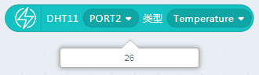
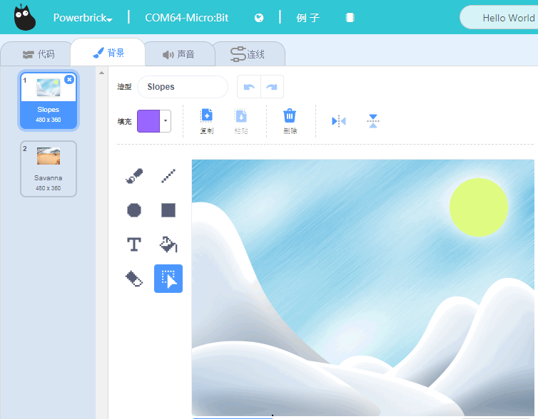
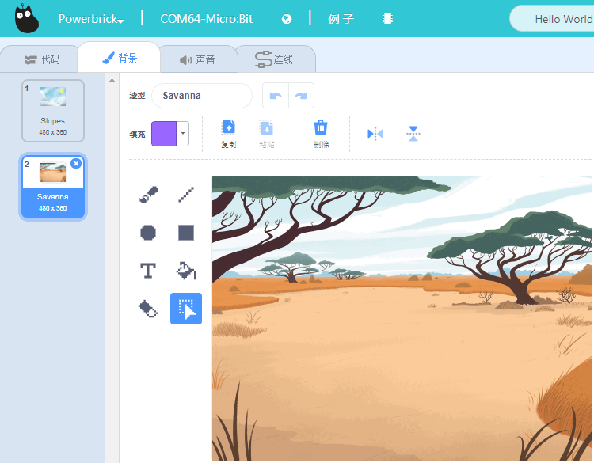
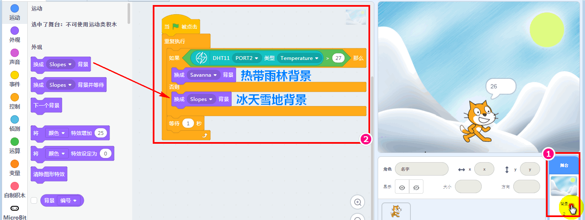
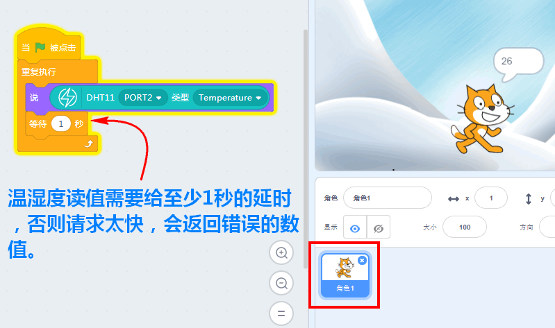
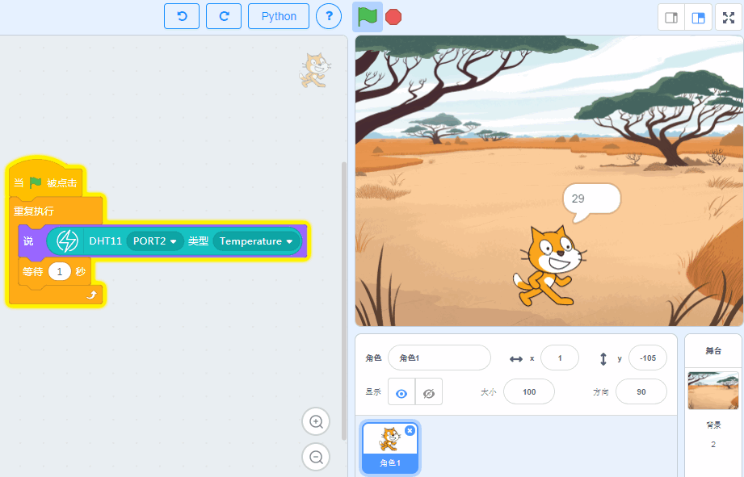

# 温湿度模拟魔块

从本节开始，我们正式进入到Powerbrick能量魔块传感器的学习中。

## 接线

1. 温湿度模拟魔块-> 主控盒 Port2

2. 电池盒->主控盒 电源接口（如果没有特殊情况说明，一般电池盒都是要插上主控盒供电的）

实物接线如图所示：

## 恢复固件连上串口

如果忘记了如何恢复固件，可以回去看03教程帖子

## 温湿度有对应的积木块

点击一下积木块，就会返回温度与湿度

## 温度控制Scratch舞台的场景

### 平时环境温度

从积木块得知环境温度为26度，那么我们就将27度设为舞台背景变换的阈值。
当温度超过27度后，舞台背景就变成热带雨林风格，否则保持背景为冰天雪地风格。

### 舞台设置

冰天雪地风格的背景：

热带雨林风格的背景：

### 舞台积木块代码

因为是对舞台进行程序逻辑编辑，所以**一定要切换到舞台**。右下方即可切换到舞台栏。程序很容易理解，这里就不赘述了。

### 让角色小猫把温度说出来

这样我们比较直接了当知道当前的温度值是多少

## 程序体验测试

用口对温湿度模块进行持续呵气，我们可以看到小猫说的值持续上升，当温度超过27度时，舞台背景就变化了

## 总结

上面的例子只利用的传感器读回来的温度与Scratch舞台进行了交互。湿度的使用方法也是一样的。自己可以尝试下

## 常见问题与解答

**1、为什么我点击积木块没有反应呢？**

首先确保操作已经按照前面帖子的操作，已经恢复固件，并且连上了串口

**2、我想像makecode那样的操作，把Microbit的程序下载到板子上可以吗？**

Microbit支持离线下载（把程序保存在电路板上，关掉电脑也能工作）和在线通讯，能量魔块暂时只支持在线通讯（程序猿还在努力中做离线下载），所以程序只含Microbit的积木块，可以进行离线下载。

**3、什么时候需要点击恢复固件**

当你需要在线通讯的调试，就应该点击恢复固件。此固件实际为在线通讯固件，如果你用makecode下载过程序或者在Kittenblock中离线下载过程序，这个在线通讯固件就会被覆盖掉，这时候如果你想用在线调试就应该先恢复固件，再点击通讯连接。