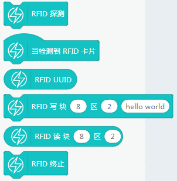
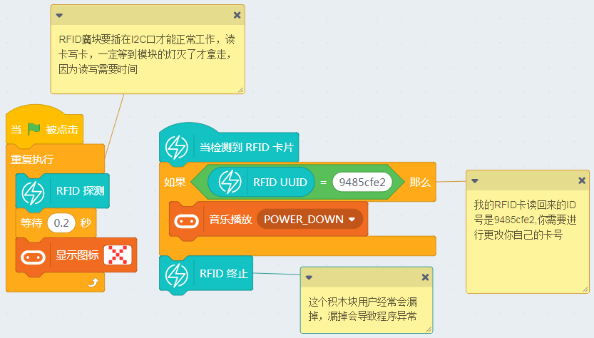
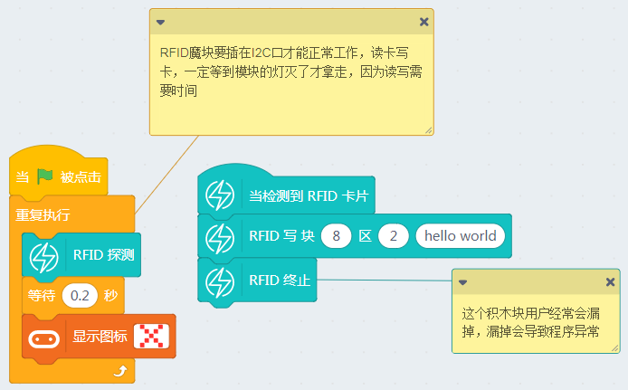

# RFID魔块

RFID魔块在能量魔块中高级模块，在市面上少有的Micorbit专用传感器。

模块的功能有以下功能：

1. 读RFID卡的ID号（每一张RFID卡都有一个独立的RFID号）

2. 对RFID的区块进行写入数据操作

3. 对RFID的区块进行读取数据操作

RFID魔块属于高级I2C通讯模块，所以只能接在Armourbit的I2C通讯接口上使用，**插到其他Port口使用无效**。

## 接线

- RFID魔块-> 主控盒 I2C口

- 电池盒->主控盒 电源接口（如果没有特殊情况说明，一般电池盒都是要插上主控盒供电的）

实物接线如图所示：

## 恢复固件连上串口

如果忘记了如何恢复固件，可以回去看03教程帖子

## RFID魔块有对应的积木块

## 读取RFID卡号功能

RFID卡操作时，记得等RFID魔块上的LED灯操作指示灯灭了后，才把卡拿开，否则读写会出错。

点击绿旗子在线运行，把RFID卡（例如公交卡，XX会员卡）放到RFID魔块上，Microbit点阵屏会显示一串字符串，此字符串就是你的RFID卡的独立唯一卡号。请记录下来，下一个程序会用到。

## 判断RFID卡号功能（类似小区进门需要刷卡的功能。）

我们需要改一下程序，把判别的卡号改成是我们自己的。

如果识别到与你的卡号一致，就会触发蜂鸣器响声

## 对RFID的区块进行写入数据操作

把RFID卡放到魔块上，等待一会，就会对卡的指定区块进行写入。保存好卡，我们下一个程序进行使用。

## 对RFID的区块进行读取数据操作

把刚才写过数据的卡放在魔块上，Microbit点阵屏就会显示出对应区块的数据了。

## 常见问题与解答

**1、为什么我点击积木块没有反应呢？**

首先确保操作已经按照前面帖子的操作，已经恢复固件，并且连上的串口

**2、我想像makecode那样的操作，把Microbit的程序下载到板子上可以吗？**

Microbit支持离线下载（把程序保存在电路板上，关掉电脑也能工作）和在线通讯，
> 能量魔块暂时只支持在线通讯（程序猿还在努力中做离线下载），所以程序只含Microbit的积木块，可以进行离线下载。

**3、什么时候需要点击恢复固件**

当你需要在线通讯的调试，就应该点击恢复固件。此固件实际为在线通讯固件，如果你用makecode下载过程序或者在Kittenblock中离线下载过程序，这个在线通讯固件就会被覆盖掉，这时候如果你想用在线调试就应该先恢复固件，再点击通讯连接。