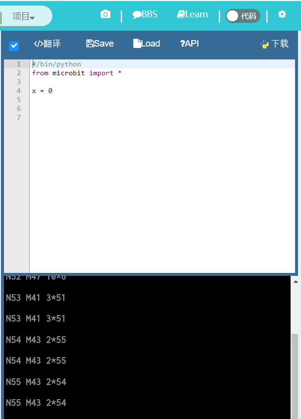
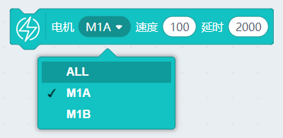
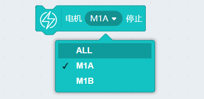
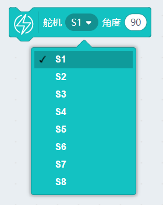
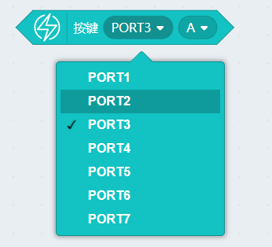
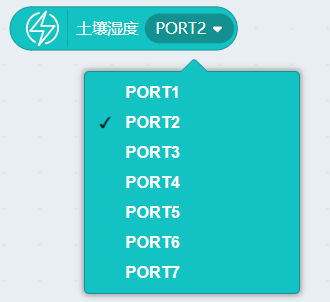
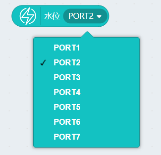
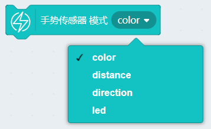

# API指令规则说明

M+数值，用于识别不同指令，M指令后通常会跟着一个或多个参数，一般用空格间隔开。

查询积木块对应API很简单，只需要连上Microbit后，恢复固件，点击对应积木块，从舞台切换到代码模式下，每当单击积木块，即可看到窗口的指令发送

同时按F12，点开后台，可以看到模块真实反馈回来的数据

----------

M21 1 100

M21为控制电机速度指令

第一位参数表示控制对象，可填，

0->ALL

1->M1A

2->M1B

第二位参数表示控制速度，可填-255-255

----------

M21 1 100 2000

第一位参数表示控制对象，可填，

0->ALL

1->M1A

2->M1B

第二位参数表示控制速度，可填-255-255

第三位参数表示设置持续时间（秒）

----------

M22 0

M22为控制电机停止指令

第一位参数表示控制对象，可填，

0->ALL

1->M1A

2->M1B

----------

M24 0 90 

M24为控制舵机角度指令

第一位参数表示控制对象，可填

0~7，分别对应S1-S8

第二位参数表示控制角度，可填

-45-225（Geekservo舵机的角度范围为270度）

----------

M15 2

M15为超声波模块距离查询指令

第一位参数表示所接的Port口，可填

1~7

----------

M40 2

M40为超声波模块上声音反馈模拟值查询指令

第一位参数表示所接的Port口，可填

1~7

----------

M41 3

M41为巡线模块AB两路巡线传感器查询指令

第一位参数表示所接的Port口，可填

1~7

----------

M42 3

M42为按键模块AB两路按键传感器查询指令

第一位参数表示所接的Port口，可填

1~7

----------

M43 2

M43为DHT11传感器查询指令，返回温度与湿度，与模拟值接口所插传感器（土壤、水位）模拟值

第一位参数表示所接的Port口，可填

1~7

同上

同上

----------

M33 3

M33为全彩点阵Port口设置指令

第一位参数表示所接的Port口，可填

1~7

----------

M31 0 81 82 43

M31为全彩点阵像素颜色设置指令

第一位参数表示设置的像素点（一个彩屏8x8一共有64个像素），可填

0~63

第二、三、四参数表示设置颜色的RGB值

----------

M30

M31为全彩点阵像素颜色设置后，刷新执行指令（设置颜色后，必须执行刷新执行才有反应）

----------

M32

M32为全彩点阵清屏指令

----------

M44 1

M44为颜色手势模块模式设置指令

第一位参数表示设置不同模式，可填

1->color 颜色识别模式

2->distence 距离检测模式

3->direction 手势方向检测模式

4->led 模块上4颗LED控制模式

----------

M45

M45为读取颜色手势模块——颜色识别模式下反馈的颜色色环值 指令，范围（1-360）

----------

M45

M45为读取颜色手势模块——颜色识别模式下反馈的颜色色环值 指令，范围（1-360）

----------

M46 100

M46为设置颜色手势模块——除LED模式外的其他模式，使用LED灯的亮度指令

----------

M47 10

M47为设置颜色手势模块——除LED模式的4颗LED亮灭状态指令

----------

M48

M48为设置颜色手势模块——距离模式下 反馈距离模拟值 指令

----------

M49

M49为设置颜色手势模块——手势识别模式下 手势识别的值 指令

没手势触发时，返回0

上右下左分别触发，返回1、2、3、4

----------

M51

M51为设置RFID模块执行探测指令

----------

当M51探测触发后，就会自动调用此帽子模块

----------

M54

M54为RFID模块读取RFID卡的唯一识别号UUID 指令

----------

M52 8 2 hello world

M52为RFID模块对RFID卡进行写入 指令

第一个参数为写入块

第二个参数为写入区（块中的区）

第三个参数为写入内容

----------

M53 8 2

M53为RFID模块对RFID卡进行读取 指令

第一个参数为读取块

第二个参数为读取区（块中的区）

默认区中的数据为无，所以读取没有数据的区返回值为空

----------

M55

M55为RFID模块行为终止指令

RFID模块的读与写工作完毕后，必须加入此模块，否则RFID一直不结束工作，会导致模块程序卡死。

----------

M56 2

M56为MP3模块Port口设置指令

第一位参数表示所接的Port口，可填

1~7

----------

M57 170

M57为MP3模块控制指令

170->播放当前歌曲
171->停止播放当前歌曲
172->上一首
173->下一首

----------

M58 100

M58为MP3模块音量设置指令

----------

M59 3

M59为指定MP3模块播放内存卡对应序号指令（打开内存卡，歌曲以一个歌曲列表进行排列，排列序号即为对应序号）

----------

M60 apple

M60为指定MP3模块播放内存卡对应名称歌曲 指令（只能是英文字符串或者数字，少于8位）