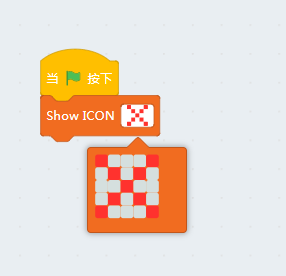
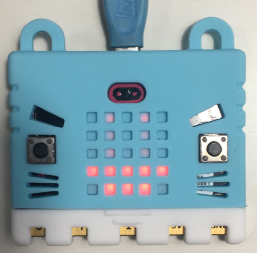

# 5x5矩阵屏的花式玩法

## Microbit显示模块介绍

Microbit的5x5矩阵屏本身集成了数十种表情功能，你可以使用显示各种有趣的效果。这个矩阵屏也可以显示数字和字符串，而且如果你的代码出错啦也会通过矩阵屏告诉你。

## Microbit显示不同的表情

首先让我们来看看上一节生成的代码

    #/bin/python
	from microbit import *
	x = 0
	display.show(Image.HEART)

第二行`from microbit import *`导入microbit板载的默认功能库，*号代表所有的对象。

x为scratch3项目的默认变量，可以不用理会

第四行，使用display对象show函数显示一个内置图案，图案变量为Image对象下的一个图形。

**注意在python下一切皆对象，**而Image和display对象就来自于第二行import的星号内的所有对象。

*PS：如果对这里python语法有点懵的同学不用紧张，我们后面会有专题介绍python语法，前期结合着图形化方块看代码就好了*

### Microbit Image对象所有的内置图形

- Image.HEART
- Image.HEART_SMALL
- Image.HAPPY
- Image.SMILE
- Image.SAD
- Image.CONFUSED
- Image.ANGRY
- Image.ASLEEP
- Image.SURPRISED
- Image.SILLY
- Image.FABULOUS
- Image.MEH
- Image.YES
- Image.NO
- Image.CLOCK12, Image.CLOCK11, Image.CLOCK10, Image.CLOCK9, Image.CLOCK8, Image.CLOCK7, Image.CLOCK6, Image.CLOCK5, Image.CLOCK4, Image.CLOCK3, Image.CLOCK2, Image.CLOCK1
- Image.ARROW_N, Image.ARROW_NE, Image.ARROW_E, Image.ARROW_SE, Image.ARROW_S, Image.ARROW_SW, Image.ARROW_W, Image.ARROW_NW
- Image.TRIANGLE
- Image.TRIANGLE_LEFT
- Image.CHESSBOARD
- Image.DIAMOND
- Image.DIAMOND_SMALL
- Image.SQUARE
- Image.SQUARE_SMALL
- Image.RABBIT
- Image.COW
- Image.MUSIC_CROTCHET
- Image.MUSIC_QUAVER
- Image.MUSIC_QUAVERS
- Image.PITCHFORK
- Image.XMAS
- Image.PACMAN
- Image.TARGET
- Image.TSHIRT
- Image.ROLLERSKATE
- Image.DUCK
- Image.HOUSE
- Image.TORTOISE
- Image.BUTTERFLY
- Image.STICKFIGURE
- Image.GHOST
- Image.SWORD
- Image.GIRAFFE
- Image.SKULL
- Image.UMBRELLA
- Image.SNAKE

如果不知道英文意思是什么就去查一下字典，学编程一定要英文好。其实一开始英文基础不好也没关系，后面接触的多了编程水平上来了英文水平也会同步进步。

## Microbit显示自定义图案

我们在Kittenblock内还有另外一个模块显示自定义的图案，点击图案可以显示下拉编辑框，之后下载到microbit上看看效果。

将kittenblock切换到代码模式，可以同步看到右侧生成的代码如下

    #/bin/python
    from microbit import *
    x = 0
    display.show(Image("90009:09090:00900:09090:90009"))

细心的同学会注意到`display.show`还是没变，里面的参数前半截`Image`也没变。但是后面的`.XXXX`变成了括号加一个迷之数字。

再次强调`Image`是一个对象，它除了可以用点来指示内置的图形序号名称外还可以当一个函数用。

    "90009:09090:00900:09090:90009"

聪明的同学应该能看出规律，双引号中的字符串可以用冒号分成5组，每一组有5个数字字母组成，好像还跟图形化方块里面的图案对的上。

恭喜你猜对了，其实数字代表每一颗LED的亮度值，分别用0~9表示，0表示让LED熄灭。

这里我们试一试手动操作代码，在代码栏中将自动翻译代码的功能暂时关了(后面记得重新打开哦~)

我们要显示一艘小船，但是小船的桅杆在迷雾中又不那么清晰，是不是很有意境呢。

将下面的代码复制到敲到代码框中并且点击下载按钮，当然也可以ctrl+C和ctrl+V (实际开发中复制粘贴别人的代码也是非常常见的，当前前提是你看懂你在复制的东西)

    from microbit import *
    
    boat = Image("05050:"
			     "05050:"
			     "05050:"
			     "99999:"
			     "09990")
    
    display.show(boat)

*这里需要注意敲代码的时候一定要切换到英文输入法，不然双引号有可能是中文字符的双引号而导致代码出错。*

其中代表桅杆的六个led灯珠亮度只有5。

但是比起LED灯亮度，可能大家会发现这跟之前自动生产的代码很不一样呃。这里要在心中再次默念“**一切皆对象**”，Image当函数用的时候实际上返回了一个对象，名字叫小船boat。

而且字符串还可以这样分成n行来写？没错，这就是python的灵活特性，在某些情况下将代码分成几行来写可以更清晰的表述意思。当然这是给人看的，编译器根本不关心你的代码怎么写的。。。

最后我们把boat对象传给show方法。

## Microbit显示动画特效

我们的小船实在太单薄了，直接被风浪击沉了。但是这该用5x5的矩阵怎么表示呢？

没关系我们矩阵屏还有动画效果，先自己领悟一下下面这个代码，并且在心中默念“一切皆对象”

	from microbit import *
	
	boat1 = Image("05050:"
	              "05050:"
	              "05050:"
	              "99999:"
	              "09990")
	
	boat2 = Image("00000:"
	              "05050:"
	              "05050:"
	              "05050:"
	              "99999")
	
	boat3 = Image("00000:"
	              "00000:"
	              "05050:"
	              "05050:"
	              "05050")
	
	boat4 = Image("00000:"
	              "00000:"
	              "00000:"
	              "05050:"
	              "05050")
	
	boat5 = Image("00000:"
	              "00000:"
	              "00000:"
	              "00000:"
	              "05050")
	
	boat6 = Image("00000:"
	              "00000:"
	              "00000:"
	              "00000:"
	              "00000")
	
	all_boats = [boat1, boat2, boat3, boat4, boat5, boat6]
	display.show(all_boats, delay=200)

将上面代码输入或者拷贝到代码区中，并点击下载，看看是不是跟你想象中的一样呢？

我们用Image初始化了6个对象，并将它们放在一个数组中。

什么？数组是什么？

类似这种用方括号括起来，并用逗号隔开来的就是数组类型，相当于把几个对象打成一个包并扔给下一个对象。它可以使用循环或者迭代器进行操作，后面我们会接触到的~

其实python就两大数据类型，一种是“数组”，还有一种是“字典”，掌握了这两种数据类型基本可以胜任80%以上开发任务。

最后我们将打包好的数组扔给display.show函数，后面delay是每一帧动画的毫秒延时。这里注意，不是所有函数都可以随便扔一个任何类型的对象都可以正常执行，而是需要函数内部支持。例如display.show就可以自适应字符串或者数组，但是如下代码就会报错

	display.show(123)

大家可以试试看micrbit是怎样跟你报错的。。

下一节我们会将具体如何使用矩阵屏显示字符和数字，那是另外一个函数。

好的接口函数不仅可以自动适应不同的数据类型，还有很多变量可选，例如我们加一个变量就可以让小船不停的下沉~

	display.show(all_boats, delay=200，loop=True)

这也是因为display.show的内部代码实现由loop这个变量的解析。

## 课后作业

**使用代码显示心跳**

----------

PS：其实python还有一种数据类型tuple，但是用的实在不是太多，而且比上面说的这两种数据类型都要简单多了。

PS2: 本教程资料来源于[micropython官方文档](http://microbit-micropython.readthedocs.io/en/latest/tutorials/images.html)

PS3：再次提醒，记得把自动翻译的√重新选上，不然后面拖的方块不生成代码