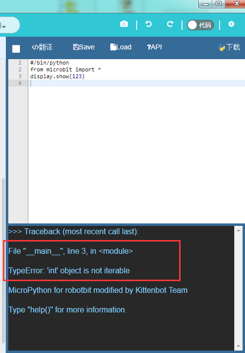
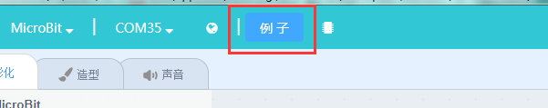
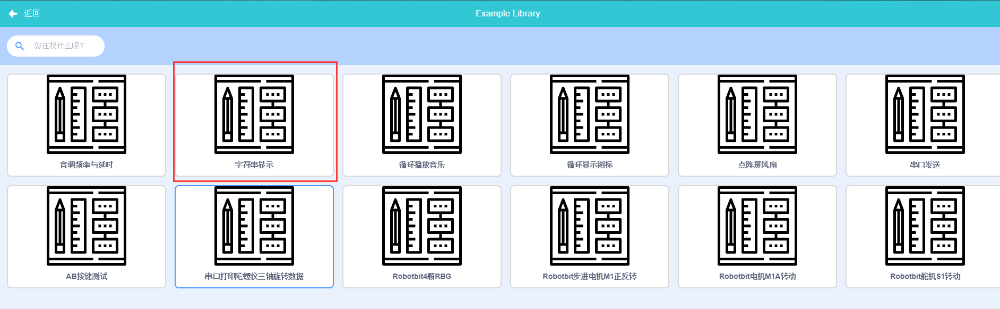

# 显示字符和数字

## 如何查看代码错误

还记得上一节我们说了Microbit会用矩阵屏抱怨你的代码有Bug吗？

这里我们将下面代码下载到Microbit上

	
	#/bin/python
	from microbit import *
	display.show(123)

下载下去后我们会看到屏幕上不停地滚动着一些字母，好像开始是个L，之后又有个T 。。。。 我本来英文就不好，你到底想说什么呢？

其实如果你的代码下载下去并不是正常执行而是类似这样滚动一些莫名其妙的字母，多半是代码出错了，但是这种报错可读性基本为0。

但是怎么办呢？我的代码怎么看都是对的。

这时候就需要我们第一章讲过的实时通讯串口了，如果驱动还没装上的同学请退回第一章或者到qq群或者社区求助。

在kittenblock通讯端口找到microbit的串口并打开，并且切换到代码模式。

之后按一下Microbit上的复位按钮，让程序重新开始执行。我们可以看到重庆后，代码窗口下面调试信息有一些输出，如下：

其实程序启动后飘过的一连串字母都可以在串口打印返回中找到。还是那句话，学编程一定要学好英文。

大致意思连蒙带猜应该可以看懂几个关键信息：

- 在哪一行出错`File "__main__", line 3, in <module>`
- 出错的内容`TypeError: 'int' object is not iterable`

还有大家要对Error这个单词特别敏感，不管它混在返回信息中任何地方都应该第一时间找到。

这里的错误实际上就是`display.show`不支持123这个输入参数了。

## 用矩阵屏显示自定义文字和数字

刚刚我们试了前面一章讲的函数不支持数字和字符，那我想让microbit显示这些东西该怎么办呢？

这里我们先打开Microbit的默认例子“字符串显示”，具体方法如下

- 在标题栏找到例子按钮

- 点击“字符串显示”例子

导入后的程序如下图，记得将自动翻译的√重新选上，或者手动点击翻译按钮

之后将程序下载到主板上，看看效果。

这里我们有了一个新武器`display.scroll("hello")`，它可以像走马灯一样滚动显示字符串。

记住一切皆对象，我们可以将字符串赋值给一个对象。

	#/bin/python
	from microbit import *
	txt = "Hello World"
	display.scroll(txt)
	txt2 = 123
	display.scroll(txt2)

这时候我们发现“Hello World”能够正常显示，但是到后面显示数字的时候又在飘异常字符了。
这时候我们有回到之前的问题，如果显示数字呢？大家注意例子里面的`123456789`用了单引号括起来了，在python中无论单引号还是双引号或者三引号括起来的东西都当做字符串处理。

什么？三引号？在键盘上哪里？

其实类似下面这种定义就是三引号了，它的特点是可以显示多行文字

	a = '''
	Hello world
	Who am I?
	'''

`display.scroll`函数只支持字符串输入，也就是被引号包裹着的类型。那么如果实在想显示数字该怎么办呢？这里我们可以使用python内置的字符串转换函数`str`

	display.scroll(str(123))

`str`函数可以将任何类型转换成字符串，包括对象。python内置的这种系统函数还有很多，我们将在下一节展开说明。

	