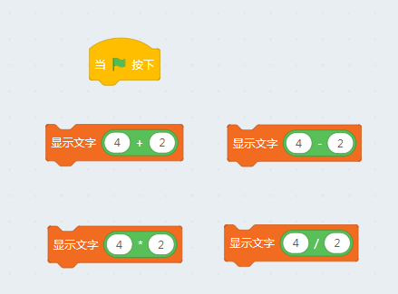
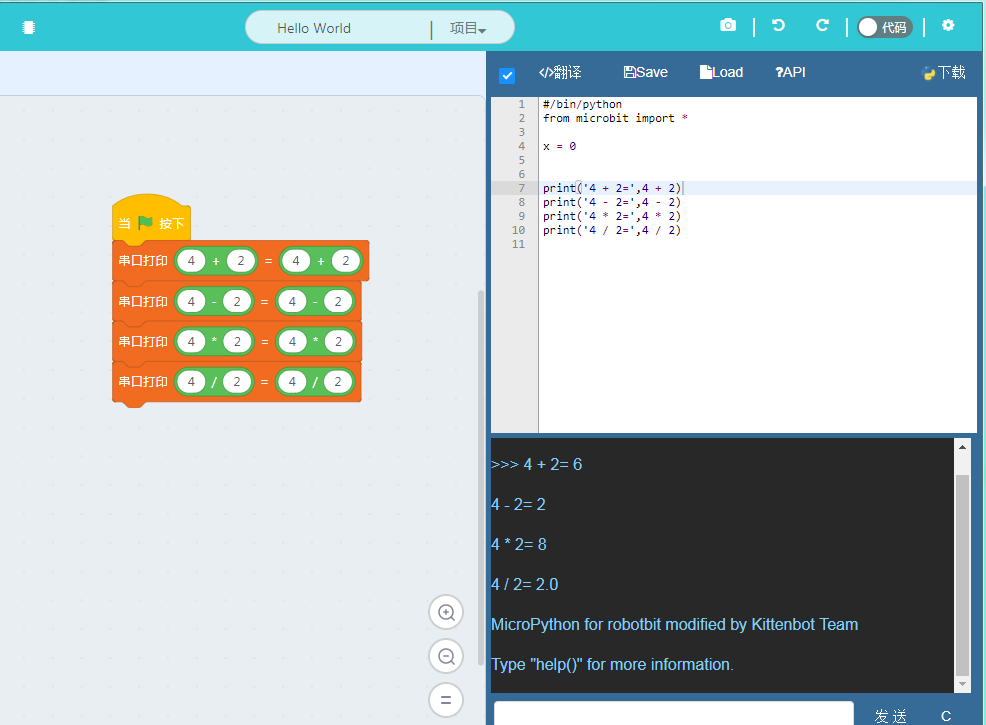

# Python基础篇1

相信通过前面几章的学习，大家都能够把手上的硬件玩起来了。对python语言也应该有一个大致的影响，是不是感觉挺有意思的？但是真正的编程学习和修炼并不是这么有意思的过程，相反还伴随着各种痛苦和让人抓狂的情况。通常浪费一两天时间调试，最后发现只是某个地方符号或者大小写弄错了。编程是一个极其注重细节的工作，需要比外科手术更高的细致，任何一点点细微的细节差错都可能导致运行结果大相庭径。不过好在python已经是一门对细节容忍比较宽松的语言了，而其他语言就没这么友好了。

这一章我们就要学习python的一些比较细碎的，但是非常有用的东西，真是这些构成了任何一门编程语言的基础功。

## Python基本计算和基本函数

### 基本四则运算

python的基本四则运算和我们正常使用的没有什么不同，不过需要注意的是在编程语言中乘法一般是星号`*`,而不是`x`。除法符号是左斜杠`/`，而不是`÷`。还有就是计算优先级的问题，括号内的计算优先级最高，同一括号内乘法除法的优先级比加减高。这跟我们小学学到的四则运算基本一样。

大家可以试试将下面的方块拖到绿旗帜下面看看生成的代码和下载进去的运行效果。多试试就可掌握其中窍门，小喵家的创始人就说过运营就是要多试，其实编程也是一样。

### 串口打印结果

大家是不是发现像上面这样一个个方块拖到绿旗帜下面，并生成代码，之后再下载很不方便呢？

这里我解释另外一个python内置函数`print`，顾名思义print就是将对象打印到串口输出上。在编程语言中我们有一个更专业的称呼是终端，或者console。一般高级语言的程序都带至少有一个输出流和一个输入流，大家可以把这些流理解为管道，实际上操作系统也是把这些当做数据管道来处理。大家在未来接触到操作系统开发，或者学习微机原理的时候会详细了解。

Micropython的默认输出流就是串口，而默认的输入流还是串口。

我们将上面的四则运算程序改造成如下形式，并且下载到microbit上面。

看看是不是一下子就在终端将结果显示出来了。

我们来详细看看由方块生成的代码：

	#/bin/python
	from microbit import *
	
	print('4 + 2=',4 + 2)
	print('4 - 2=',4 - 2)
	print('4 * 2=',4 * 2)
	print('4 / 2=',4 / 2)

可以看到每个print函数内由两部分组成，前半部分是一个单引号括住的字符串，后半部分基本一样只是没用引号括住。还记得我们之前说过，python下不管拿单引号、双引号还是三引号括住的部分都当做字符串处理。字符串扔给print函数，解释器会原封不动地将字符串输出到终端。而没有用括号括住的部分，解释器则认为它是一个表达式，会尝试对其进行计算并输出结果。

## 查看python的对象

还记得之前唠叨的“万物皆对象”的五字箴言吗？那么对象到底是什么呢？能看得到摸得着嘛？

有了print这个大杀器后我们就可以看清楚对象到底是什么。我们首先拿Microbit的库函数开刀：

	import microbit
	print(microbit)

返回值为 `<module 'microbit'>`,意思是microbit是一个名字叫microbit的模块。
但是这个信息明显没什么意义，这里要用到另外两个python的内置函数`type`和`dir`。我们将上面的代码改造一下，重新下载。

	import microbit
	print(microbit)
	print(type(microbit))
	print(dir(microbit))

打印返回如下

	<module 'microbit'>
	
	<class 'module'>
	
	['__name__', 'Image', 'display', 'button_a', 'button_b', 'accelerometer', 'compass', 'i2c', 'uart', 'spi', 'reset', 'sleep', 'running_time', 'panic', 'temperature', 'pin0', 'pin1', 'pin2', 'pin3', 'pin4', 'pin5', 'pin6', 'pin7', 'pin8', 'pin9', 'pin10', 'pin11', 'pin12', 'pin13', 'pin14', 'pin15', 'pin16', 'pin19', 'pin20']

大家可以猜到，`type`返回的是对象原型，我们可以再试试之前我们已经接触到的几个变量类型。
	
	#/bin/python
	from microbit import *
	a = Image.HEART
	print(type(a))

	b = 123
	print(type(b))

	c = "hello world"
	print(type(c))

	d = display
	print(type(d))

返回值分别是

	<class 'MicroBitImage'>
	
	<class 'int'>
	
	<class 'str'>
	
	<class 'MicroBitDisplay'>

大家可能会发现，不论是函数、数字、字符串还是一个内置常量返回都是class，这也就是“万物皆对象”。而对象的类型则不尽相同，但是好像`str`我们之前用过了，可以让一个数字变成字符串。那么`int`是不是就可以把字符串再变回为数字呢？我们马上来试一下，将下面代码下载到microbit上
	
	#/bin/python
	a = "12345"
	print(type(a))
	b = int(a)
	print(b)
	print(type(b))

返回值如下：

	<class 'str'>
	
	12345
	
	<class 'int'>

果然跟猜测的一样吧，优秀的程序员会一直要保持浓厚的好奇心。为什么这么多程序员都喜欢猫，因为程序员跟猫一样对这个世界充满好奇。不要害怕出错或弄坏硬件，要多试试自己的猜想是不是正确，这些沉淀下来的最后都是宝贵的知识。

回到前面，除了`type`我们好像还用了另外一个函数`dir`，而且它返回的信息量更大。dir函数在python内犹如一台x光机的存在，它可以返回一个对象内的任何信息，并按照字母顺序输出。

	['__name__', 'Image', 'display', 'button_a', 'button_b', 'accelerometer', 'compass', 'i2c', 'uart', 'spi', 'reset', 'sleep', 'running_time', 'panic', 'temperature', 'pin0', 'pin1', 'pin2', 'pin3', 'pin4', 'pin5', 'pin6', 'pin7', 'pin8', 'pin9', 'pin10', 'pin11', 'pin12', 'pin13', 'pin14', 'pin15', 'pin16', 'pin19', 'pin20']

细心的同学还会发现，我们前面用过的`display`对象和`Image`对象也在其中，而且还有好多没见过的东西在里面。这章就到这里结束了，想必看到这么多没见过的对象肯定有同学心里痒痒的，那么就自己写写代码做实验吧，看看你的猜想对不对。

*其实这里面有好几个对象作者本人也是第一次见，现在迫不及待地去试试看到底是什么。*

