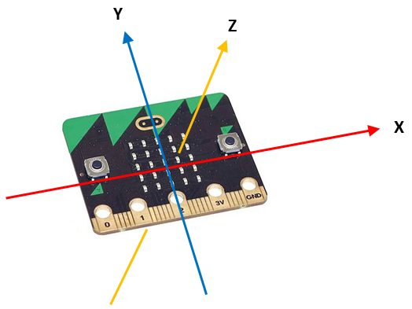
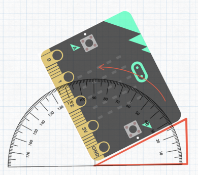
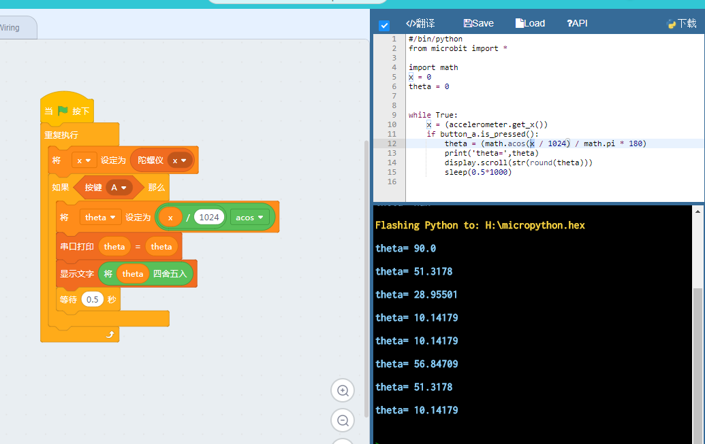

# 加速度计

Microbit除了板载了矩阵屏和按键外，还有另外两个相当有特色的硬件模块--一个陀螺仪和一个指南针芯片。

大家可以看看自己手上的microbit背面，左下角的两个芯片就分别是指南针（compass）和陀螺仪（accelerometer）

## 加速度计原理

我们都学过三大力学定律，也知道在没有收到力的情况下物体将保持当前的运动状态。而我们在地球上也时时刻刻受到一个力，我们母星的万有引力。我们平时用的秤也是以重力作为参考，衡量其作用下的质量大小，简单说就是被称物体将弹簧拉长了多少。那么这么小小一粒的加速度计芯片内部原理也类似，大家可以看看下图：

中间那个一长条是一个参考质量，四个角用具有弹性的金属材料固定，因此它收到力会产生位移。而其边上有固定着的金属探测点，当金属条移动时它与探测点间的电荷率产生了变化，而外围驱动电路就是坚持电荷变化以测得力的大小。注意我们上面说的都是在芯片内部，即使上诉所说的位移实际上也就几个微米。上图只是一个示意说明，大多数陀螺仪芯片除了可以测量xyz方向还有三个角速度的加速度大小，因此实际上是一个多层的立体结构，但是原理大致相同。

## 读取加速度大小

这是我们碰到的按键外另一种Microbit返回值型模块，大家可以看看kittenblock的microbit分栏下那些圆形模块。Kittenblock可以通过直接点击microbit模块，在线执行模块并读取返回值，而不需要翻译成python代码并下载。我们需要先给microbit下载一个空固件，所谓空固件就是指在编程区没有其他任何方块的时候生产的固件，如下图：

可以看到在右侧生成的代码除了import和默认变量外什么东西都没有，将这个固件下载到microbit上，之后连接上串口。

接下来我们将一个陀螺仪方块拖到工作区，并将方向选为z，并直接点击方块看看返回值。

之后将microbit正反翻一个面再读一下返回值。这实际上指示着重力的值，大小就是重力加速度的大小。关于microbit陀螺仪定义如下图：

大家可以多试试将microbit翻转到不同方向看看输出。

## 用Microbit做一个量角器

大家可能会碰到要量一个墙面是不是垂直，或者地面是不是水平或者一个斜坡有多少度的情况。这时候我们就可以使用microbit做一个量角器了。

当重力矢量重合于某一个坐标轴时，其值是一个G也就是1024。我们这里用X方向的重力大小，除以1G并做反余弦计算出角度大小。注意这其中有弧度和角度变换的关系，并且还需要对浮点数整数化方便阅读。

我们拖入下面的方块,并执行检查转译出来的代码，之后下载到microbit上面：

注意我们这里还新增了一个变量theta

**PS:由于重力是向三个坐标投影的，因此前后的晃动（z方向）会影响到x，y本身的重力投影大小。大家可以试试用已经掌握的3D打印技术，给microbit做一个平稳的底座让他能垂直地固定在测量平面上。**

ps2:量角器项目原出处：[https://microbitmathsblog.wordpress.com/2017/01/28/microbit-protractor/](https://microbitmathsblog.wordpress.com/2017/01/28/microbit-protractor/)

