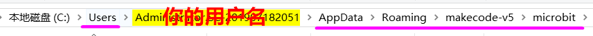
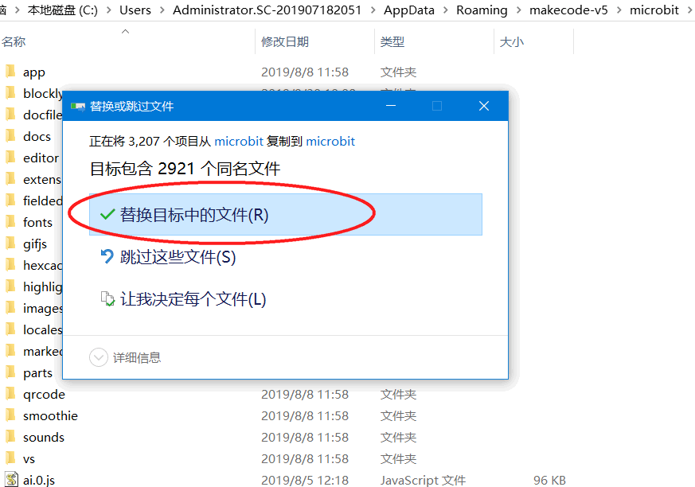
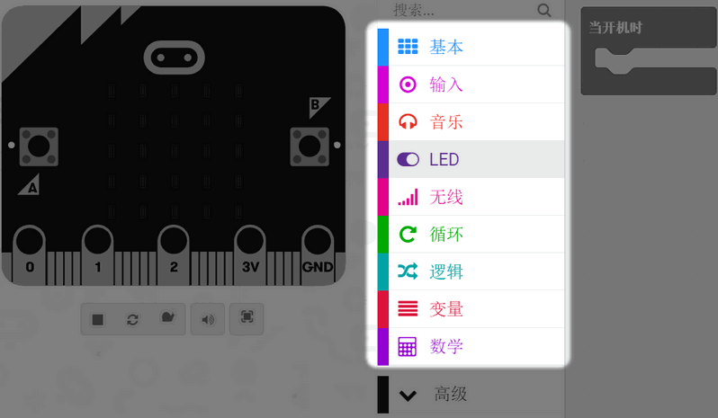

# 解决makecode V5界面显示英文问题

## 缘由

相信大家已经安装上喵家出品的makecode的最新离线版本安装完，大家打开Microbit，居然发现部分分栏显示是英文的！中英文显然不能给学生上课哈。

后面找到原因，原来是程序的某个翻译文件有问题，后续版本喵家已经修复了。只是需要大家进行升级。

问题又来了，现在这个V5版本的升级机制，有点问题，对用户网络要求太高（主要更新的小文件太多了），很多时候不能成功更新。

所以这篇文章教大家如何进行手动更新

## 下载

软件更新的本质是打补丁。我们只需要下载这些文件覆盖到Microbit就好。

百度云盘下载：

链接：https://pan.baidu.com/s/1fj6FdXSZwhFgeF_po9krqA 
提取码：a2pn 

如果网盘没办法下载，可以在Q群寻求帮助，让其已经更新好的友友，把那个文件夹发你。

## 解压

下载下来的压缩包进行解压，得到如下的文件，全选（ctrl+a），复制

## 粘贴覆盖

打开你的C盘！C盘！C盘！

找到这个路径，只要你安装了喵家的makecodeV5,**绝对有这个路径**，而且是**一模一样**。

有些用户的电脑里面不止一个用户名（Users文件夹下有多个用户名的文件夹），需要自己仔细找找。

**AppDate是系统的隐藏文件**，所以你对应要设置显示隐藏文件（不懂百度下显示隐藏文件）。

把刚才复制的文件，粘贴到这个Microbit文件夹内，系统会提示，是否要进行覆盖。**选择替换全部**

## 完成

等待覆盖完毕，重启MakecodeV5，就可以看到，软件已经显示更新了。

## 下载没反应？

有部分老师反馈，点击下载按钮没反应。

可能有两个原因：

- microbit没有枚举成功，请自行检查Microbit盘符，是否存在，或者是被360杀毒软件拦截了。先关闭掉杀毒软件。

- 如果已经枚举成功了，有可能是软件设置权限的问题。

右键V5的图标，右键——属性——兼容性——**设置 管理员权限运行，把勾勾勾上**，确认保存

