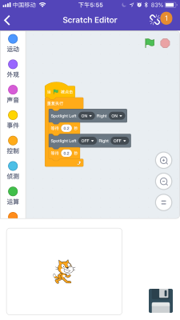

# KBlock APP

## 最新app版本 **V2.31**
- UI界面重新设计(不要在再吐槽难看了，我们没设计师的情况下只能做到这样了~)
- 加入app内scratch3编程功能
- 目前可以同步kittenblock最新的项目到手机端运行和编辑

目前小喵家的APP已经在苹果的APP store和Google Play上架，大家可以直接搜索kittenbot下载。

Android用户也可以直接下载下面的apk进行安装：

[http://cdn.kittenbot.cn/app/kblock_v2.31.apk](http://cdn.kittenbot.cn/app/kblock_v2.31.apk)

## IPAD 版本

Ipad版本跟手机app完全不一样，更加接近pc上的kittenblock版本，针对大屏幕设备做了很多优化。

请在ipad设备上前往苹果商店搜索kittenbotHD就行了

## 

大家也可以前往我们论坛的app发布和讨论帖提出bug和修改建议：

[论坛APP发布帖](http://kittenbot.cn/bbs/forum.php?mod=viewthread&tid=241&extra=page%3D1)

