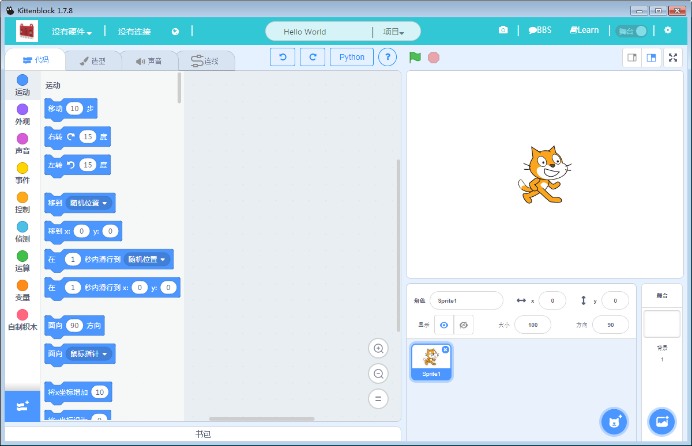
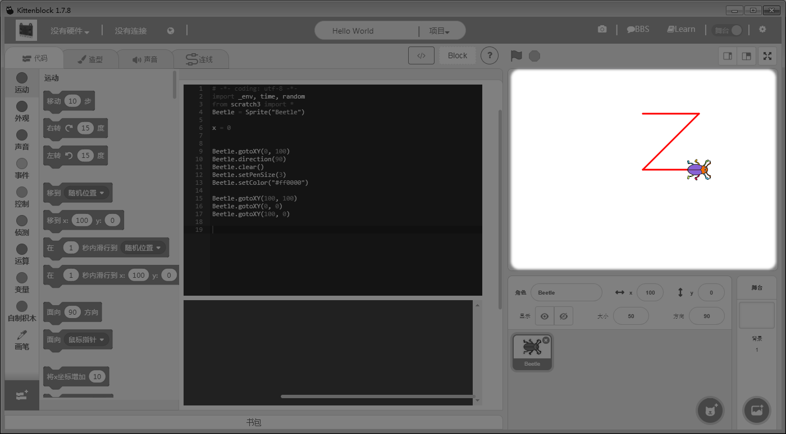
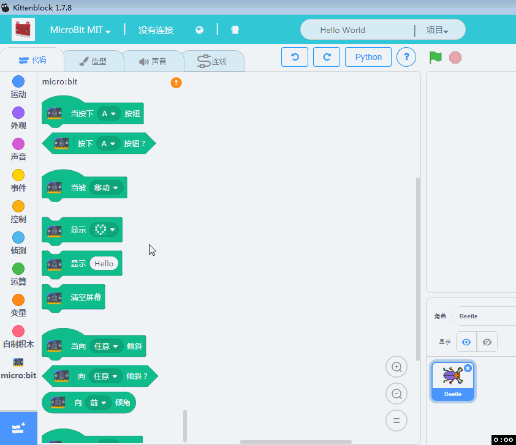
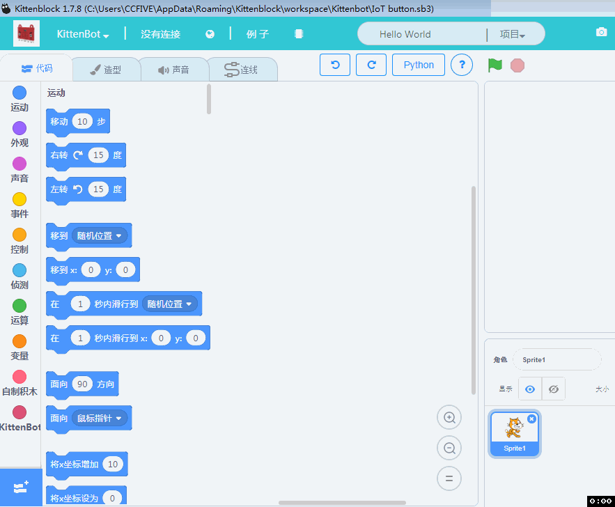
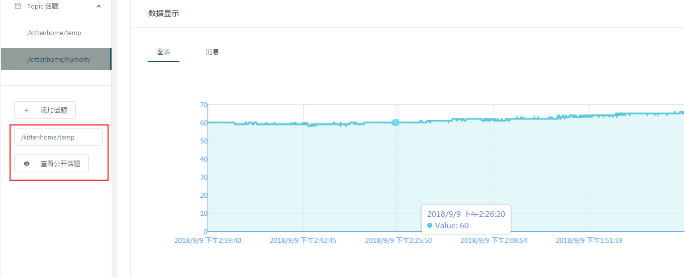
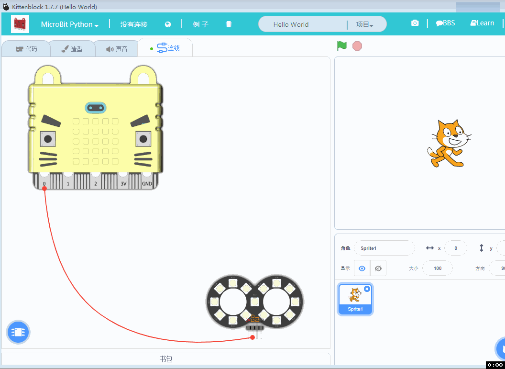
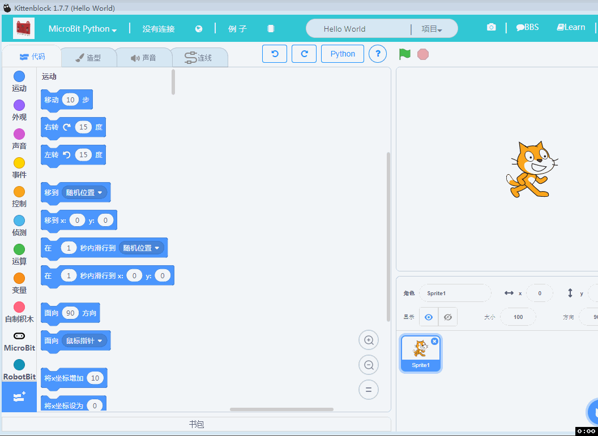
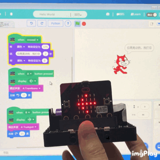
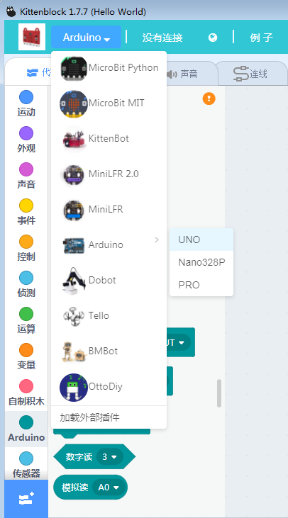
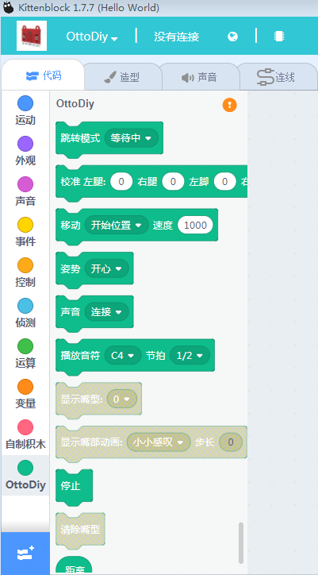

# Kittenblock

## 最新版本V1.80 下载地址

windows： [http://cdn.kittenbot.cn/win/Kittenblock Setup 1.8.0.exe](http://cdn.kittenbot.cn/win/Kittenblock%20Setup%201.8.0.exe)

mac: [http://cdn.kittenbot.cn/mac/Kittenblock-1.8.0.dmg](http://cdn.kittenbot.cn/mac/Kittenblock-1.8.0.dmg)

历史版本和改进意见请前往我们的bbs发布帖子，谢谢 ~

http://kittenbot.cn/bbs/forum.php?mod=viewthread&tid=115

# V1.80 更新笔记
- TensorFlow插件稳定版本，导入TensorFlow插件后可以按`~`打开控制台
- 扩展插件本地化，大家可以更加方便地添加自己的硬件和扩展插件，所有硬件插件代码都放在我们的github仓库
- Micropython在线固件重构，现在支持蓝牙模式，并且小程序也是使用这个固件（大家可以在微信小程序中搜索microbit）

# V1.78 Kittenblock迭代说明   

更新内容如下   
重要程度和推荐程度排名分先后~

## python功能增强

### “海龟作图”   

对于一些学校缺经费，或者初级阶段不想买硬件，或者怕硬件管理麻烦，不妨试一试零硬件入门python，小喵黑科技为大家完善python这块学习。

如果之前有入门过python的朋友，肯定听过“海龟作图”。就是用python控制“海龟”来画画，它的效果是这样的：

   

咦？！海龟呢？

看下海龟作图的官方定义：在海龟作图中，我们可以编写指令让一个虚拟的（想象中的）海龟在屏幕上来回移动。
没错就是虚拟的海龟！全凭脑补！

   

对于初次接触python的中小学生，脑补真的不太好，无法引起他们的兴趣。所以我们用了具体的人物形象

所以小喵做了真·“海龟”作图，因为Scratch角色库缺了海龟，我们用个小虫子代替哈。角色形象与画笔颜色都可以由学生来定义！做出属于他们独特的海龟。这样零硬件试运行python学习，不怕硬件购买后用不上。

[开启你的python学习海龟作图第一课吧！](http://learn.kittenbot.cn/zh_CN/latest/scratch3_python3/01prepare.html#)

   

### 拖拽积木块实时转译python

对于中小学生刚刚接触python，如果让他们直接用代码控制，可能有一定难度，所以在此小喵科技做了循序渐进的，积木块转python，你还在担心学习Python的门槛高么？

   

### 首席工程师亲自上阵Scratch—python入门傻瓜教程

才不止这么一点点，[Scratch—python入门傻瓜教程](http://learn.kittenbot.cn/zh_CN/latest/scratch3_python3/index.html)，会持续更新，有兴趣的喵粉可以持续关注我们的Learn

   

## 同类硬件克隆并交互   

这期不得不隆重介绍另外一个黑科技，喵家Kittenblock正式打通多硬件交互。例如5块Microbit同时蓝牙连接在一台电脑上进行通讯。N台带喵家wifi的小车进行通讯、N台Dobot机械臂进行联动等等...充分释放用户的创意~！
我们的黑科技亮点不在于能连多少台小车或者板子，我们希望能让老师课堂互动更加有趣一些。例如两块Microbit板子连接在Kittenblock中，做一个Scratch舞台交互的赛跑游戏，这比各玩各的有趣多了。

   

## 不同硬件相互交互

很早之前有用户问过我们能不能用Microbit控制大疆小飞机Tello，相信有一部分有技术的网友，通过一些奇淫巧技成功控制起来。但是那也是一个人的狂欢。喵家一直秉承为用户提供更低门槛的软硬件。我们希望把软件做好，让用户轻而易举的，通过一个硬件电路板控制另外一个硬件电路板，释放更多的创意，而不是纠结与技术门槛中

   

   

## IoT插件更新与内置示例

IoT功能，喵家经过努力，已经非常完善，而且很好使！之前做了Makecode的IoT插件，这次又把Kittenblock的IoT插件完善了，只有你是arduino体系的（Rosbot、Uno、nano等等）都可以使用我们的IoT积木块，IoT对应的wifi模块就是喵家的wifi模块，之前已经拥有了喵家wifi模块的朋友可以自行升级到新版固件2.8支持IoT。

[wifi固件更新教程点我](http://learn.kittenbot.cn/zh_CN/latest/electronics/wifi.html)

[物联网IoT详细使用教程点我](http://learn.kittenbot.cn/zh_CN/latest/IoT/index.html)

   

接线图，请直接点开连线标签

   

软件内置IoT控制面板快速入口（你需要提前登陆，账号就是我们论坛BBS的账号）

   

进入IoT控制面板，你可以新建自己的话题，或者查看开放的话题

例如喵家做了个IoT测喵家办公室的温湿度，每隔5分钟上传一次，你可以大概看到喵家的生存环境

填入你要查看的公开话题，点击查看。这也是我们和其他家IoT不一样的地方，话题不是一串无意义的字符串，而是可以大家之间相互交流的话题了!

喵家办公室的温湿度话题分别是：

/kittenhome/temp

/kittenhome/humdity

   

## 软件其它bug修改   

例行bug修改~

----------

## V1.77 下载地址

windows： [http://cdn.kittenbot.cn/win/Kittenblock%20Setup%201.7.7.exe](http://cdn.kittenbot.cn/win/Kittenblock%20Setup%201.7.7.exe)

mac: [http://cdn.kittenbot.cn/mac/Kittenblock-1.7.7.dmg](http://cdn.kittenbot.cn/mac/Kittenblock-1.7.7.dmg)

历史版本和改进意见请前往我们的bbs发布帖子，谢谢 ~

http://kittenbot.cn/bbs/forum.php?mod=viewthread&tid=115

# V1.77 Kittenblock迭代说明   

更新内容如下   
重要程度和推荐程度排名分先后~

## 连线引擎改进提升   
连线引擎完整度已经很高了，非常适合普通用户对硬件接线进行示意。没有Fritzing那种条条框框限制，只需要打开喵家硬件图片或者导入其他图片，图片用线条快速连接。并且右上角还有截屏保存的功能。

### 内置喵家体系模块图片   
   

### 支持外部加载模块图片   
   

### 支持图片旋转与缩放   

   

### 标签栏中有连线标签提醒   

   

### 连线图直接保存在sb3
以后分享程序，就可以知道连线图了！再也不用再发什么说明提示了。
而且也便于大家修改与交流。

## 集成 MIT所做的Microbit   

   

### 只能使用蓝牙连接   
MIT为Microbit所做的积木块，只能使用蓝牙连接，而且只能在线跑（也就是Kittenblock软件要开着），不能离线下载到软件上。毕竟MIT的意思，就是做出来打通Microbit硬件与Scratch舞台的交互。   
   

小喵跟进时代潮流，所以推出配搭的蓝牙适配器，[购买请戳我](https://item.taobao.com/item.htm?spm=a1z10.3-c-s.w4002-17001215033.23.4df4762ezd8L0C&id=575550334097)   

### 需要烧录MIT为Microbit对应写的固件   

也就是Microbit使用蓝牙前需要提前烧录一个hex文件。   
为了方便用户，我们已经把hex文件内置到Kittenblock中的恢复固件图标。点一下就帮你恢复MIT的Microbit固件，是不是很方便？   

   

## arduino积木块开源，另外已经开放API让用户接入自己插件   

### arduino积木块开源   

   

之前小喵这边自行修改了arduino的一些标准库，例如arduino那种常见bug，蜂鸣器与舵机一起会不行，占用同一个定时器。为了后续让大家交流之间比较好沟通，arduino积木分栏中全部回复成arduino的标准库。让大家按照标准来就好。arduino积木块图形化插件这块开源。有能力有技术的友友，可以参照这些代码进行改写，或者增加新的arduino模块。众人拾柴火焰高，有些小模块的需求，喵家实在忙不过来，授人以鱼不如授人以渔，爱好者可以自行实现，有bug喵家也会进行维护帮助。

### Kittenblock插件API开放   

   

后续用户可以根据我们所提供的开发帖子，自行加入自己的插件。喵家会一直维护好这个框架。插件API开放仅限于爱好者的学习交流，禁止用于商业用途。有商业用途需求请找我们的喵老板进行商业合作洽谈~
插件API具体使用方法，请参考Learn相关帖子。

插件制作方法详情请查看：[Kittenblock插件开发指南](http://learn.kittenbot.cn/zh_CN/latest/kittenblock/%E6%8F%92%E4%BB%B6%E5%BC%80%E5%8F%91%E6%8C%87%E5%8D%97.html)

## 硬件连接框架更改
对用户来说可能只是一个UI或者是用户习惯的改变，为了跟MIT对接与适配后面软件的发展，我们重构了软件的连接框架。大家使用的时候注意下，改变下习惯就好。

## ottoDIY插件翻译   

   

## Kittenbot灯条使用的颗数不限制

   

## 小bug的修改

