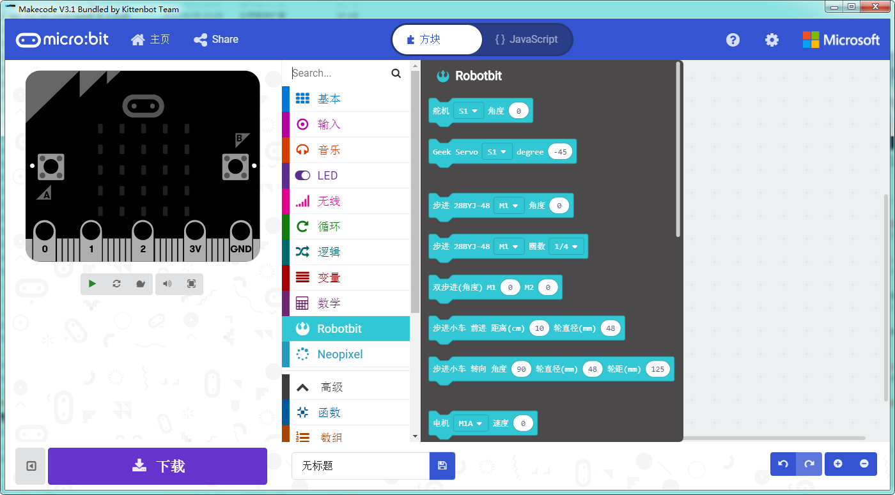

# Makecode离线版本

## 目前最新离线版本 V3.2

3.2版本加入了pxt-neomatrix插件的支持，具体参考[https://github.com/KittenBot/pxt-neomatrix](https://github.com/KittenBot/pxt-neomatrix)

### Windows (v3.2)
 
[http://cdn.kittenbot.cn/makecode/win/Makecode%20Setup%203.2.0.exe](http://cdn.kittenbot.cn/makecode/win/Makecode%20Setup%203.2.0.exe)

### Mac

[http://cdn.kittenbot.cn/makecode/mac/Makecode-3.1.0.dmg](http://cdn.kittenbot.cn/makecode/mac/Makecode-3.1.0.dmg)

大家也可以前往我们论坛的makecode发布和讨论帖提出bug和修改建议：

[论坛Makecode发布帖](http://kittenbot.cn/bbs/forum.php?mod=viewthread&tid=156&extra=page%3D1)